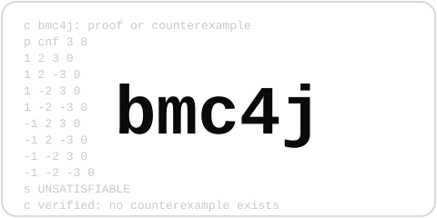

<p align="center"></p>

<p align="center">
  <a href="https://central.sonatype.com/artifact/org.bmc4j/bmc-runtime"></a>
  <a href="https://plugins.gradle.org/plugin/org.bmc4j"></a>
  <a href="https://github.com/bmc4j/bmc4j/actions/workflows/ci.yml"></a>
  <a href="LICENSE"></a>
</p>

**Prove your Kotlin (or Java) code correct for *every* input — as easily as writing a JUnit test.**

A unit test checks the inputs you thought of. A property-based test samples a few
hundred more. A `@BmcProof` covers **all of them at once**: apply one Gradle plugin,
write a test-shaped method, and [JBMC](https://www.cprover.org/jbmc/) *proves* (within
an explicit bound) that no input breaks your code — or fails the test with a real stack
trace and the exact input that does.

bmc4j targets the **JVM**: **Kotlin** (2.0–2.4) and **Java** (17–25) are the verified,
first-class languages — it analyses the bytecode, so your build doesn't change beyond
the one plugin. (Kotlin 1.9 is supported via the artifacts' 1.9 metadata/stdlib floor,
just no longer re-verified on every merge — see
[docs/internals.md](docs/internals.md#java--kotlin-versions).)

> ⚠️ **Early development.** bmc4j is pre-1.0 (`0.x`) and under active development:
> APIs, the `bmc { }` DSL, and model coverage are still moving. While pre-1.0, minor
> releases may add features *and* break things; patch releases are fixes and model
> additions only — see the [GitHub releases](https://github.com/bmc4j/bmc4j/releases)
> for per-release notes.
> The soundness discipline is not provisional — but treat everything else as subject
> to change.

```kotlin
// build.gradle.kts
plugins {
    java
    id("org.bmc4j") version "<version>" // latest: see the Maven Central badge above
}
```

Kotlin-first: your domain invariants already live in a value class's `require(...)`, so bmc4j
folds them straight into the proof domain via `assumeValid { ... }` — no assumption restated.

```kotlin
import org.bmc4j.Bmc.*
import org.bmc4j.BmcProof
import org.bmc4j.kotlin.assumeValid

@JvmInline
value class Score(val value: Int) { init { require(value in 1..100) } }  // the domain, once

class GradeBandProofs {

    @BmcProof
    fun `Score invariant holds`() {
        val s = assumeValid { Score(anyInt()) } // run the constructor over ALL ints
        check(s.value in 1..100)                 // checks the invariant is never violated
    }

    @BmcProof
    fun `gradeBand never throws for any Score`() {
        val score = assumeValid { Score(anyInt()) } // require(...) folded into the domain —
        gradeBand(score.value)                       // no duplicated assume, proven for every Score
    }
}
```

<details>
<summary>Java</summary>

```java
import org.bmc4j.Bmc;
import org.bmc4j.BmcProof;

class GradeBandProofTests {

    @BmcProof
    void gradeBand_never_throws_for_valid_scores() {
        int score = Bmc.anyInt();               // symbolic input — ALL values at once
        Bmc.assume(score >= 1 && score <= 100); // restrict to the valid domain
        Example.gradeBand(score);               // proven for every score in range
    }

    @BmcProof
    void clamp_result_is_always_within_bounds() {
        int x = Bmc.anyInt(), lo = Bmc.anyInt(), hi = Bmc.anyInt();
        Bmc.assume(lo <= hi);
        int r = Example.clamp(x, lo, hi);
        Bmc.check(r >= lo && r <= hi);          // a property to prove
    }
}
```

</details>

```
./gradlew test
```

That's it. The engine ships as an ordinary, integrity-verified dependency — no runtime
download, no install, works offline. Each `@BmcProof` is a real JUnit 5 test: it shows
up in the test tree, runs from the IDE gutter, and a refuted proof fails like any
assertion — except the failure comes with the *proof* that it had to:

```
gradeBand_never_throws_for_valid_scores()  FAILED
  org.bmc4j.engine.BmcVerificationError: JBMC refuted ...gradeBand_never_throws_for_valid_scores
    ✗ Array index should be < length  (Example.java:16)
      counterexample: score = 100
      replay:
        int score = 100;
        // then run the body of GradeBandProofTests.gradeBand_never_throws_for_valid_scores with these value(s)
      replay test written to: build/bmc4j/replays/GradeBandProofTests_gradeBand_never_throws_for_valid_scoresReplay.java
    at example.Example.gradeBand(Example.java:16)
    at proofs.GradeBandProofTests.gradeBand_never_throws_for_valid_scores(GradeBandProofTests.java:20)
```

The counterexample renders as concrete source you can paste into a scratch test and step
through in a debugger — and bmc4j drops a ready-to-run `@Test` scaffold next to it. The
scaffold matches the language of the proof: a Kotlin proof class gets a `.kt` replay
(`val` bindings, Kotlin literals), a Java proof class gets a `.java` one. Pin the language
with `bmc { replayLanguage = "kotlin" }` (or `"java"` / `"auto"`, the default), overridable
per run with `-Pbmc.replayLanguage=...`.

## Key principles

1. **Soundness & three-way verification.** A wrong verdict is worse than no verdict: anything
   bmc4j can't analyse fails loud and named (an unmodelled JDK member is a member-named UNKNOWN,
   never a quiet green), and the stand-in models are held to three independent checks —
   differential testing against the real JDK, algebraic law proofs under JBMC itself, and an
   enforced per-member audit the coverage docs are generated from.
2. **Developer experience.** Proofs are ordinary JUnit 5 tests: one Gradle plugin, the IDE
   gutter, real stack traces, counterexamples as runnable replay tests in your proof's language.

**What's supported today:**

- **Kotlin (2.0–2.4) and Java (17–25)** as first-class, re-verified-on-every-merge languages — analysis is bytecode-level, so the build doesn't change beyond the plugin
- `@BmcProof` JUnit 5 proofs with symbolic inputs (`anyInt(...)` & friends), `assume`/`check`, and expected-verdict pins (`expect = REFUTED/UNKNOWN/...`) so deliberate failures are regression-tested
- `assumeValid { ... }` — Kotlin `require(...)`/`init` invariants (value classes included) folded straight into the proof domain
- **Method contracts** (`@Requires`/`@Ensures`): modular proofs via contract redirect, auto-generated enforce proofs, a conservative purity audit — Kotlin-first, including `suspend` functions
- **Jakarta validation integration**: `assumeValid(bean)` generated from constraint annotations, including `@Valid` cascades and container-element constraints
- Conformance-proven **JDK + Kotlin stdlib models** (collections, streams, BigDecimal/BigInteger, java.time, coroutines under the immediate-dispatch idealization) with the per-member audit above
- **Counterexample replays**: refuted proofs write a ready-to-run scratch test in your proof's language
- **Fast re-runs**: proofs run in parallel, and verdict caching skips proofs whose module hasn't changed
- **Vacuity detection** — a proof whose assumptions rule out every input is flagged, not passed
- **User models with declared intent** (`conformant`/`domain`) — shadow any class on the analysis path, with provenance footnotes naming every model/stub a green verdict relied on
- **Bundled engines** for windows-x64, linux-x64/arm64 (glibc), linux-x64 (musl/Alpine), and macos-x64/arm64 — no install

## What is bounded model checking?

Instead of *running* your code on some inputs, BMC **translates** it — bytecode,
branches, loops (unwound to a bound) — together with the property into one big logical
formula, and hands that to a SAT solver. If the formula is satisfiable, the solver has
constructed an input that breaks the property: that's your counterexample, decoded back
into concrete values. If it's unsatisfiable, **no such input exists** — the property is
proven for *every* input within the bound, not observed on a sample of them. So a
`@BmcProof` isn't a very fast test loop; it's a single symbolic execution of all inputs
simultaneously, with a solver doing the search.

## Why a proof instead of more tests?

| | covers | misses | on failure |
|---|---|---|---|
| **Unit test** | the inputs you wrote down | everything you didn't think of | a known case |
| **Property-based test** | a few hundred random samples per run | needle-in-a-haystack inputs (one bad value in 4 billion), rare branch combinations | a shrunken sample, if sampling found one |
| **`@BmcProof`** | **every input within the bound** | nothing inside the bound — refutation is guaranteed if a bad input exists | the exact counterexample, rendered as runnable code |

The off-by-one that only fires at `score = 100`, the overflow at `Integer.MIN_VALUE`,
the rounding rule that's wrong in one of 10⁹ cases — sampling is structurally bad at
these; exhaustive search is not. Proofs are also **deterministic**: no flaky seed, no
"passed this run." The three approaches complement each other — bmc4j replaces neither
your unit tests nor your integration tests; it covers the class of bug they can't.

## When to use it

`@BmcProof` answers *"is my logic sound?"* It shines on pure(ish), bounded logic where
a wrong answer is expensive:

- **Money & rounding** — pricing, tax, interest, `BigDecimal` scale rules
- **Parsers, codecs, serializers** — round-trips, bounds, malformed input
- **State machines & business rules** — invariants, unreachable-state proofs
- **Validation & clamping** — range checks, normalization, overflow on arithmetic
- **Index arithmetic** — pagination, buffers, windowing, binary search
- **Equality/ordering laws** — `equals`/`hashCode`/`compareTo` contracts, record laws

It's also a **debugger that works backwards**: when you know a bad state exists — the
total that went negative in production, the enum combination that "can't happen", the
corrupted invariant — but not which input gets there, write the bad state as the
property (`Bmc.check(!bad)`) and let the refutation *find the input for you*. The
counterexample is a ready-made reproduction of the bug, dropped into
`build/bmc4j/replays/` as a runnable test.

And when **not** to: I/O and frameworks (mock boundaries, prove the logic between them),
float-heavy numerics (IEEE-754 is slow in a SAT solver — prefer integer models),
unbounded structures (everything is proven *within a bound*), and concurrency
verification (see the note below).

> **Concurrency: out of scope, by design.** bmc4j is a **sequential** logic checker. It
> does **not** verify thread interleavings, races, or linearizability — that's a
> fundamentally different search that explodes combinatorially under BMC, so it isn't a
> roadmap item, it's [Lincheck](https://github.com/JetBrains/lincheck)'s job. What bmc4j
> *does* cover is the **sequential logic** that runs through concurrent constructs: the
> `java.util.concurrent` types (`Atomic*`, `ConcurrentHashMap`, queues, latches,
> executors, …) are modeled with single-threaded semantics so the logic that uses them
> stays fully provable. **Kotlin coroutines** are the same story — the *sequential* logic
> inside `suspend` functions proves fine via the bundled `runBlocking`/dispatcher models,
> but coroutine *concurrency* (suspension scheduling, structured concurrency) is not
> modeled. See [`examples/kotlin-coroutines-and-lincheck`](examples/kotlin-coroutines-and-lincheck),
> which puts a `@BmcProof` (logic) and a Lincheck test (concurrency) side by side to show
> each tool catching exactly the bug the other is blind to. bmc4j is Lincheck's
> complement for sequential logic, not its competitor.

## The tradeoffs, honestly

Bounded model checking is a power tool with a real contract. The short version:

- **Bounded, not unbounded.** Loops unwind to `unwind`; proofs hold *within* the bound.
  An insufficient bound is **reported as UNKNOWN, not silently trusted** and never
  mislabeled a refutation (`--unwinding-assertions` is on by default).
- **Three-way verdict.** A proof is **verified**, **refuted** (with a counterexample),
  or **UNKNOWN** — undecided within budget. UNKNOWN fails the test but says so
  distinctly: a solver timeout is not "your code is wrong."
- **Solver time can blow up** on specific shapes — symbolic multiply/divide/modulo and
  long symbolic strings are the classic ones. There's a **toolbox** for it (range
  reduction, domain splitting, external SAT, contracts, parallelism/sharding/caching —
  different levers for different blow-ups, and they compose); a `timeoutSeconds` budget
  turns a runaway solve into a named UNKNOWN. See [docs/performance.md](docs/performance.md).
- **The JDK is modeled, not loaded.** bmc4j ships sound bounded models for the common
  surface (collections, `Optional`, `Stream`, `BigInteger`/`BigDecimal`, `java.time`,
  Kotlin stdlib) and **detects** anything unmodeled instead of letting it pass silently
  — a green proof that leaned on an unmodeled method gets a footnote naming it
  (`strictStubs` turns that into UNKNOWN).
- **Soundness is engineered, not assumed.** JBMC's known unsound spots (string
  equality, `invokedynamic` from string concat / records / lambdas) are rewritten to
  sound forms in bmc4j's own layer; vacuous proofs (contradictory `assume`s) fail
  loudly instead of passing over an empty domain. And the models themselves are
  **verified on two axes** — differential property tests against the real JDK, plus
  ~200 `@BmcProof` laws proven under the engine itself — with a coverage gate that
  fails the build on any unverified model
  ([how we know the models are sound](docs/model-soundness.md)).

The full, unvarnished list — including what is still stubbed and the residual quirks —
is in [docs/limits.md](docs/limits.md). Read it before trusting a proof with money.

## New to BMC? About proof runtimes

The first surprise for newcomers: a proof's runtime tracks the size of its *formula*,
not the speed of your code — so a proof can take seconds, and a small change can make
it take minutes. **That's normal, it isn't a bug in your code, and it's very tunable**:
the same proof over a sensible input range typically solves orders of magnitude faster
while still covering every value you'll ever see, and a timeout turns a runaway solve
into a clean, named UNKNOWN instead of a hung build. Don't let one slow proof scare you
off: hard proofs are tractable because bmc4j gives you a **toolbox** for them — caching,
parallelism, sharding, domain splitting, external SAT, and contracts, each aimed at a
different blow-up and **composable**. [docs/performance.md](docs/performance.md) is the
decision tree — which shape explodes, which lever fixes it, and how to stack them (a
domain split can reclaim a slow proof's full range by solving each slice independently).

## Documentation

| | |
|---|---|
| [docs/api.md](docs/api.md) | the full `Bmc.*` API: symbolic inputs, `assume`/`check`, symbolic objects & strings, config readers, floating-point rules, stub detection |
| [docs/contracts.md](docs/contracts.md) | modular proofs: `@Requires`/`@Ensures` method contracts — prove once, reuse at every call site |
| [docs/configuration.md](docs/configuration.md) | the `bmc { }` block: unwind, parallelism, the external SAT solver, the verdict cache, timeouts, stub policy |
| [docs/performance.md](docs/performance.md) | performance & scaling: the toolbox for slow / out-of-memory proofs — caching, parallelism, sharding, domain splitting, external SAT, contracts — which lever for which blow-up, and how they compose |
| [docs/trust.md](docs/trust.md) | trust & isolation: the bundled-engine model, `jbmcPath` escape hatch |
| [docs/model-soundness.md](docs/model-soundness.md) | how we know the models are sound: differential conformance vs the real JDK + the models' own laws proven under the engine, gated in CI |
| [docs/internals.md](docs/internals.md) | how it works, module layout, platform support, verified Java/Kotlin ranges |
| [docs/coverage.md](docs/coverage.md) | the coverage map: every language construct and stdlib API — modeled / partial / stubbed / out-of-scope |
| [docs/limits.md](docs/limits.md) | known limits, in full |
| [`examples/`](examples) | a guided, read-along tour — 9 topic modules, each concept with its own README, code, and expected output |

## Status

| | |
|---|---|
| Engine | CBMC 6.9.0 / JBMC, bundled per platform: windows-x64, linux-x64/arm64 (glibc), linux-x64 (musl/Alpine), macos-x64/arm64. Windows-arm64 is unsupported (fail fast) |
| Kotlin | 2.0 – 2.4 verified on every merge via a consumer-compiler matrix (null-safety, data classes, collections, `runBlocking` logic); 1.9 supported via the artifacts' 1.9 metadata/stdlib floor |
| Java | 17 – 25 verified on every merge (full suite on 21/25, core + conformance on the 17 floor) |
| CI | per-platform engine jars + a proof gate on every platform, every supported JDK, and consumer-Kotlin 2.0/2.2/2.3/2.4 |
| License | [Apache-2.0](LICENSE); bundled engine binaries under the [CBMC license](THIRD-PARTY-NOTICES.md) |

## Developing

The repo is one Gradle build: the product lives under `core/`, the `examples/` and the
model-conformance proof suite are child projects wired via `includeBuild` — open the
repo, click the gutter icon next to any `@BmcProof`.

```powershell
./gradlew -p core build                                        # product + unit tests
./gradlew test                                                 # everything: conformance proofs + all examples
./gradlew :examples:fundamentals-java:test                     # or just one topic module
```

The fail-on-purpose demo proofs declare their expected verdict
(`@BmcProof(expect = REFUTED / VACUOUS / TIMEOUT)`), so they pass while the guard
they demonstrate holds — the root `test` is green by design, and a demo drifting
back to VERIFIED fails loudly.

## License & acknowledgements

bmc4j is licensed under the [Apache License 2.0](LICENSE) — including the
`examples/`, so you can copy-paste from them freely. The per-platform engine jars
redistribute the official CBMC/JBMC release binaries, which remain under the
[CBMC license](THIRD-PARTY-NOTICES.md) (BSD-4-clause style); every published jar
carries the full notices in `META-INF/`.

> This product includes software developed by Daniel Kroening, Edmund Clarke,
> Computer Science Department, University of Oxford, Computer Science Department,
> Carnegie Mellon University

Contributions: see [CONTRIBUTING.md](CONTRIBUTING.md). Found a way to make a
false proof show green? That's a security-grade bug — see [SECURITY.md](SECURITY.md).
